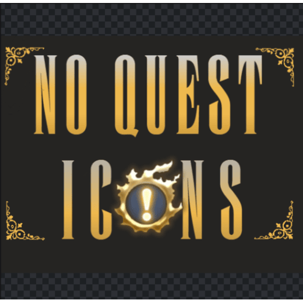

# NoQuestIcons



**NoQuestIcons** is a [Dalamud](https://github.com/goatcorp/Dalamud) plugin for *Final Fantasy XIV* that completely removes the quest icons (diamonds, exclamation/question marks) above NPC nameplates.

## ✨ Features
- Hides quest icons from all NPC nameplates.
- Works 100% client-side — no game files are modified.
- Zero flickering.
- Simple configuration via a tabbed settings window.

## 📦 Installation
1. Add this repository to your **Dalamud Custom Plugin Repositories**.
   - Open Dalamud Settings → Experimental tab → Custom Plugin Repositories.
   - Add:
     ```
     https://raw.githubusercontent.com/YourName/NoQuestIcons/main/pluginmaster.json
     ```
2. Search for **NoQuestIcons** in the Plugin Installer and install it.

## ⚙️ Usage
- Open the plugin settings from the Dalamud plugin menu.
- Use the **General** tab to toggle quest icon visibility.
- Advanced and About tabs provide extra options and info.

## 📚 Development
This plugin is built against **Dalamud API 13.1.0**.  
Clone the repo and build with Visual Studio 2022 or Rider.

## 📝 License
This project is licensed under the [MIT License](LICENSE).

## 🙌 Credits
- Plugin author: Grimmortal Dread
- Built with Dalamud API
